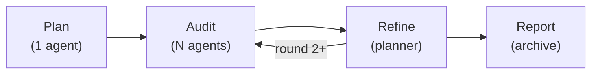

# Planora

Multi-agent implementation plan orchestrator. Planora coordinates multiple AI coding agents to generate, audit, refine, and report on implementation plans — producing higher-quality plans than any single agent alone.

## How It Works

Planora runs a multi-phase pipeline:



1. **Plan** — A planner agent generates an initial implementation plan from your task description.
2. **Audit** — Multiple auditor agents review the plan in parallel, each producing independent feedback.
3. **Refine** — The planner incorporates all audit feedback and produces a refined plan.
4. **Report** — Outputs are archived with compressed streams, and a `latest` symlink is created.

Steps 2–3 repeat for as many rounds as configured (default: 1).

## Supported Agents

| Agent | Binary | Default Model | Stream Format |
|---|---|---|---|
| `claude` | `claude` | claude-opus-4-6 | Claude JSONL |
| `copilot` | `copilot` | claude-sonnet-4.5 | Copilot JSONL |
| `codex` | `codex` | gpt-5.4 | Codex JSONL |
| `gemini` | `gemini` | gemini-3.1-pro-preview | Gemini |
| `opencode-kimi` | `opencode` | opencode/kimi-k2.5-free | OpenCode JSONL |
| `opencode-glm` | `opencode` | zai-coding-plan/glm-4.7 | OpenCode JSONL |
| `opencode-minimax` | `opencode` | opencode/minimax-m2.5-free | OpenCode JSONL |

Each agent's model, timeouts, and environment variables can be overridden via configuration.

## Installation

Requires Python 3.12+.

```bash
# Core install
uv pip install -e .

# With TUI dashboard
uv pip install -e ".[tui]"

# With OpenTelemetry support
uv pip install -e ".[telemetry]"

# Full dev setup
uv pip install -e ".[dev,tui,telemetry]"
```

You also need at least one agent CLI installed and authenticated. Verify with:

```bash
planora agents check
```

## Quick Start

```bash
# Run with defaults (planner: claude, auditors: gemini + codex)
planora plan run "Add a REST API for user management with auth"

# Interactive wizard — prompts for task description
planora plan run -i

# Read task from file
planora plan run --task-file task.md

# Pipe task via stdin
cat task.md | planora plan run

# Launch the TUI dashboard
planora plan run --tui "Add WebSocket support to the notification service"
```

## CLI Reference

### `planora plan run`

```
planora plan run [TASK] [OPTIONS]

Options:
  --task-file PATH          Read task from file
  --planner TEXT            Planner agent (default: claude)
  --auditors TEXT           Comma-separated auditor list (default: gemini,codex)
  --audit-rounds INT        Audit+refine cycles, 1-2 (default: 1)
  --concurrency INT         Max parallel auditors (default: 3)
  --skip-planning           Reuse existing initial-plan.md
  --skip-audit              Skip audit phases
  --skip-refinement         Skip refinement phases
  --dry-run                 Show commands without executing
  -i, --interactive         Launch interactive wizard
  --tui                     Launch TUI dashboard
  --output-format TEXT      text (default) or events (JSONL on stderr)
  --project-root PATH       Override project root detection
  --stall-timeout FLOAT     Normal stall threshold in seconds (default: 300)
  --deep-timeout FLOAT      Deep tool stall threshold in seconds (default: 600)
  --profile TEXT            Activate a named profile from planora.toml
  --config TEXT             Override config key=value (dot notation, repeatable)
```

### `planora plan resume`

Resume an interrupted run from the existing `.plan-workspace/` directory. Detects completed phases and only re-runs what's missing.

```bash
planora plan resume
```

### `planora plan wizard`

Step-by-step interactive wizard for task entry and plan execution.

### `planora agents list`

Show registered agents and their availability.

```bash
planora agents list              # Rich table
planora agents list --format json  # JSON output
```

### `planora agents check`

Validate agent CLIs are installed, versioned, and authenticated.

```bash
planora agents check                    # Check all agents
planora agents check --agents claude,gemini  # Check specific agents
```

## TUI Dashboard

The interactive TUI (requires `planora[tui]`) provides:

- **Pipeline progress** — Visual multi-phase workflow timeline
- **Agent activity** — Real-time tool execution tracking
- **Agent output** — Live-streaming markdown output
- **Status panel** — State, elapsed time, tool counters
- **Cost tracker** — Real-time USD cost aggregation
- **Event log** — Timestamped event history

Key bindings:

| Key | Action |
|---|---|
| `p` | Pause workflow |
| `c` | Cancel workflow |
| `s` | Skip current phase |
| `l` | Toggle log visibility |
| `q` | Quit |

## Configuration

Configuration is resolved in this order (highest priority first):

1. CLI flags
2. Environment variables (`PLANORA_*` prefix)
3. `.env` / `.env.local` files
4. `planora.toml` (project-level)
5. `~/.config/planora/config.toml` (user-level)
6. `pyproject.toml` (`[tool.planora]` section)
7. Built-in defaults

### Example `planora.toml`

```toml
[defaults]
planner = "claude"
auditors = ["gemini", "codex"]
concurrency = 3
audit_rounds = 1

[agents.claude]
model = "claude-opus-4-6"
stall_timeout = 300.0
env = { CLAUDE_CODE_EFFORT_LEVEL = "high" }

[agents.codex]
model = "gpt-5.4"

[observability]
stall_timeout = 300.0
deep_tool_timeout = 600.0
monitor_interval = 5.0

[telemetry]
enabled = true
otlp_endpoint = "http://localhost:4317"
otlp_protocol = "grpc"
service_name = "planora"

[prompts]
plan = "path/to/plan.j2"
audit = "path/to/audit.j2"
refine = "path/to/refine.j2"

# Named profiles
[profiles.fast]
planner = "gemini"
auditors = ["claude"]
```

### Environment Variables

```bash
PLANORA_DEFAULT_PLANNER=claude
PLANORA_DEFAULT_AUDITORS=gemini,codex
PLANORA_DEFAULT_CONCURRENCY=3
PLANORA_DEFAULT_AUDIT_ROUNDS=1
```

### Profiles

Activate a named profile at runtime:

```bash
planora plan run --profile fast "Refactor the auth module"
```

### Config Overrides

Override any config key from the CLI:

```bash
planora plan run --config agents.claude.model=claude-sonnet-4-6 "Build a cache layer"
```

## Workspace & Output

During execution, Planora writes to `.plan-workspace/` in the project root:

```
.plan-workspace/
├── task-input.md            # Original task description
├── initial-plan.md          # Phase 1 output
├── audit-gemini.md          # Audit from gemini (round 1)
├── audit-codex.md           # Audit from codex (round 1)
├── audit-gemini-r2.md       # Audit from gemini (round 2, if configured)
├── final-plan.md            # Refined plan
├── *.stream                 # Raw JSONL agent streams
└── *.log                    # Agent logs
```

On completion, outputs are archived to `reports/plans/{timestamp}_{slug}/` with stream files gzip-compressed. A `latest` symlink always points to the most recent archive.

## Observability

### Stall Detection

Planora monitors agent output streams and injects synthetic `STALL` events when an agent goes silent:

- **Normal tools**: 300s timeout (configurable)
- **Deep tools** (deep_search, tavily_research, etc.): 600s timeout (configurable)

### OpenTelemetry

Optional OTLP export for tracing (requires `planora[telemetry]`):

```toml
[telemetry]
enabled = true
otlp_endpoint = "http://localhost:4317"
otlp_protocol = "grpc"  # or "http"
```

Creates spans for the full pipeline, each phase, and each agent execution.

### Claude Code Hooks

When running the Claude agent, Planora installs temporary pre/post tool-use hooks in `.planora-hooks/` for fine-grained event logging. Hooks are cleaned up automatically after execution.

## Development

```bash
make install      # Install with dev + tui extras
make check        # Run all checks (fmt, lint, typecheck, security, test)
make fmt          # Format with ruff
make lint         # Lint with ruff
make typecheck    # Type check with mypy --strict
make security     # Security scan with bandit
make test         # Run tests with pytest
make coverage     # Run tests with coverage report
make build        # Build package
```

### Project Structure

```
src/planora/
├── core/           # Config (Pydantic), events, workspace management
├── cli/            # Typer CLI — plan, agents, callbacks
├── agents/         # Registry, runner, monitor, stream parsing, filtering, stall detection
├── workflow/       # Phase engine, plan workflow orchestration, report generation
├── prompts/        # Jinja2 prompt templates and audit contracts
├── tui/            # Textual dashboard — screens, widgets, styles
└── observability/  # OpenTelemetry telemetry and Claude hooks
```

## License

See [LICENSE](LICENSE) for details.
